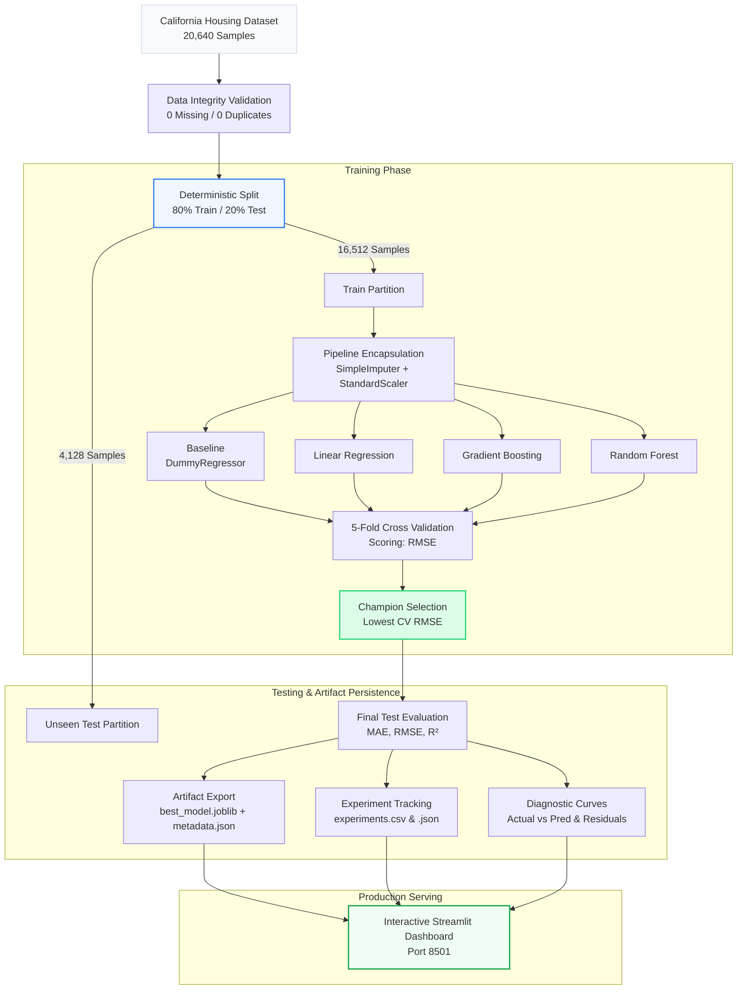
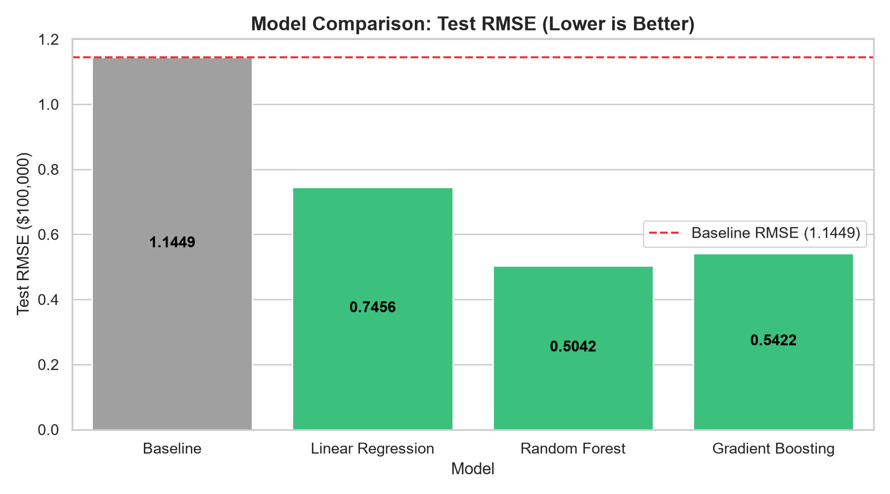
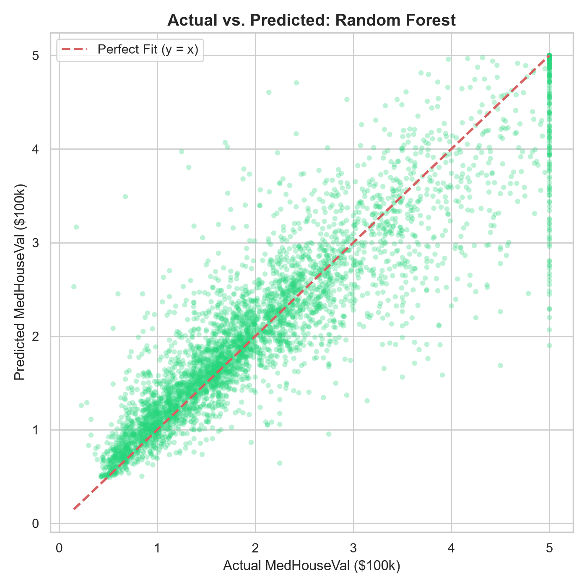
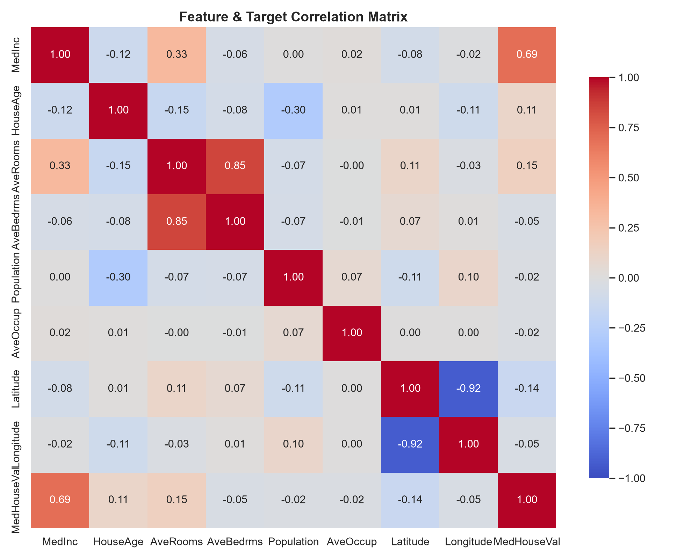

<div align="center">

# 🧪 ML Model Lab
### Production-Grade, Leak-Free Regression Benchmarking & Real-Time Valuation System

[](https://www.python.org/)
[](https://scikit-learn.org/)
[](https://streamlit.io/)
[](https://docs.pytest.org/)
[]()

<p align="center">
  <b>A reproducible, enterprise-standard machine learning laboratory comparing regression architectures against a naive baseline on California census records, backed by strict data-leakage boundaries and an interactive Streamlit application.</b>
</p>

[Key Features](#-key-features) •
[Architecture & Pipeline](#-system-architecture) •
[Benchmark Results](#-empirical-benchmark-results) •
[Quickstart](#-quickstart-guide) •
[Project Structure](#-repository-structure) •
[Evaluation & Diagnostics](#-model-diagnostics)

</div>

---

## 📌 Executive Summary

Many machine learning projects demonstrate overly optimistic test scores due to subtle data leakage (e.g., fitting scalers on the full dataset before splitting, or tuning hyperparameters directly against the test partition). 

**ML Model Lab** is built to establish an honest, auditable engineering benchmark:
- **Zero Data Leakage**: Enforces a strict *split-first* paradigm. Transformations (median imputations and standard scalers) are encapsulated inside scikit-learn `Pipeline` objects and fitted purely on training partitions.
- **Fair Baseline Benchmarking**: Every architecture is rigorously benchmarked against a `DummyRegressor` (predict-the-mean baseline) to verify genuine algorithmic value add.
- **Cross-Validation Model Selection**: Winning architectures are selected based exclusively on **5-Fold Cross-Validation RMSE** on the training fold, reserving the test partition solely for final unbiased validation.
- **Production Persistence & Dashboard**: Persists trained pipelines with metadata, experiment tracking ledgers (CSV & JSON), and an interactive Streamlit UI designed with modern minimalist UX principles.

---

## 🏗️ System Architecture

The following diagram illustrates the complete, leak-free training lifecycle:



---

## 📊 Empirical Benchmark Results

All metrics below are extracted directly from [`results/metrics.csv`](results/metrics.csv) generated during model execution (`seed=42`, $N = 20,640$). Runs repeated across fresh environments yield identical figures down to four decimal places.

| Model Architecture | 5-Fold CV RMSE | Test MAE | Test RMSE | Test $R^2$ | Beats Baseline? | Improvement vs. Baseline |
| :--- | :---: | :---: | :---: | :---: | :---: | :---: |
| **Baseline (DummyRegressor)** | $1.1562 \pm 0.0122$ | $0.9061$ | $1.1449$ | $-0.0002$ | ❌ Baseline | $0.00\%$ |
| **Linear Regression** | $0.7205 \pm 0.0139$ | $0.5332$ | $0.7456$ | $0.5758$ | ✅ **True** | $+34.88\%$ |
| **Gradient Boosting** | $0.5321 \pm 0.0115$ | $0.3717$ | $0.5422$ | $0.7756$ | ✅ **True** | $+52.64\%$ |
| **Random Forest (Champion)** | $\mathbf{0.5097 \pm 0.0124}$ | $\mathbf{0.3268}$ | $\mathbf{0.5042}$ | $\mathbf{0.8060}$ | ✅ **True** | $\mathbf{+55.96\%}$ |

### Empirical Insights
1. **Algorithmic Lift**: Random Forest reduced prediction error by **$55.96\%$** relative to baseline, achieving a Test RMSE of **$0.5042$** (corresponding to $\approx \$50,420$ on a median target of $\$100,000$).
2. **Variance Explanation**: Random Forest explains **$80.60\%$** of target price variance ($R^2 = 0.8060$), substantially outperforming standard linear combinations ($57.58\%$).
3. **Generalization Stability**: Training 5-fold CV RMSE ($0.5097$) closely aligns with the held-out test partition RMSE ($0.5042$), demonstrating low overfitting and strong out-of-fold generalization.

<div align="center">
  
  <p><i>Figure 1: Test RMSE Comparison across evaluated architectures (Lower is Better).</i></p>
</div>

---

## 🔍 Model Diagnostics

### 1. Actual vs. Predicted (Random Forest)
The champion model demonstrates strong diagonal linearity across typical property valuations ($\$100,000$ to $\$400,000$). At the upper boundary ($\$500,000$), the horizontal band reflects the artificial census cap present in the original dataset.

<div align="center">
  
  <p><i>Figure 2: Actual vs. Predicted values on held-out test data for Random Forest.</i></p>
</div>

### 2. Feature & Target Correlation Structure
Feature correlation matrix computed on raw census attributes highlights that **Median Household Income (`MedInc`)** exhibits the strongest linear association ($r = 0.69$) with home valuation.

<div align="center">
  
  <p><i>Figure 3: Pearson correlation matrix across all numeric features and target.</i></p>
</div>

---

## 🚀 Quickstart Guide

### 1. Prerequisites
- **Python**: Version `3.12` or higher (verified on Python `3.13.12`)
- **Git**

### 2. Environment Setup
Clone the repository and create an isolated virtual environment:

```bash
# Clone the repository
git clone https://github.com/your-username/ml-model-lab.git
cd ml-model-lab

# Create virtual environment
python -m venv .venv

# Activate environment
# On Windows:
.venv\Scripts\activate
# On macOS / Linux:
source .venv/bin/activate

# Install dependencies and local package in editable mode
pip install -r requirements-dev.txt -e .
```

### 3. Execution Pipeline

```bash
# 1. Execute end-to-end training, CV selection, and plot generation
python -m mlmodellab.train

# 2. Run automated test suite (offline, synthetic)
pytest -q

# 3. Launch the interactive Streamlit dashboard
streamlit run app/streamlit_app.py
```

Navigate to `http://localhost:8501` to access the application.

---

## 📁 Repository Structure

```
ml-model-lab/
├── app/
│   └── streamlit_app.py        # Streamlit dashboard interface
├── assets/
│   └── img/                    # Benchmark plots and visual assets
├── models/
│   ├── best_model.joblib       # Serialized champion Pipeline (preprocessor + model)
│   └── metadata.json           # Model metadata, training ranges, and audit info
├── reports/
│   └── figures/                # High-resolution generated diagnostic PNGs
├── results/
│   ├── environment.txt         # Dependency lock snapshot (pip freeze)
│   ├── experiments.csv         # Experiment tracking ledger (CSV format)
│   ├── experiments.json        # Structured tracking history (JSON format)
│   └── metrics.csv             # Final metrics comparison table
├── src/
│   └── mlmodellab/
│       ├── __init__.py
│       ├── artifacts.py        # Serialization & deserialization utilities
│       ├── config.py           # Central configurations, seeds, and paths
│       ├── data.py             # Dataset fetching, validation, and quality audit
│       ├── evaluate.py         # Regression metrics & K-fold CV calculations
│       ├── features.py         # Sklearn preprocessing pipeline builder
│       ├── models.py           # Model factory creating encapsulated pipelines
│       ├── plots.py            # Headless publication-quality plot generators
│       ├── predict.py          # Input validation & single-sample inference
│       ├── tracking.py         # Experiment tracking logger
│       └── train.py            # CLI entrypoint for training pipeline
├── tests/
│   ├── test_artifacts.py       # Persistence & roundtrip tests
│   ├── test_config.py          # Configuration consistency tests
│   ├── test_data.py            # Validation & schema integrity tests
│   ├── test_evaluate.py        # Exact arithmetic metric verification
│   ├── test_models.py          # Data leakage & split determinism tests
│   └── test_predict.py         # Inference bounds & validation tests
├── .gitignore
├── pyproject.toml              # Build & package configuration
├── README.md
├── requirements.txt            # Production dependencies
├── requirements-dev.txt        # Development & testing dependencies
└── setup.py                    # Package setup script
```

---

## 🛡️ Software Engineering & Testing Standards

The repository includes a comprehensive `pytest` test suite configured to run completely offline using deterministic synthetic fixtures:

```bash
$ pytest -q
....................                                                     [100%]
20 passed in 2.65s
```

### Key Test Guarantees:
- **Leakage Immunity (`tests/test_models.py`)**: Asserts that preprocessing parameters (e.g., standard scaler $\mu$ and $\sigma^2$) remain strictly unchanged even when extreme outliers are introduced into test samples.
- **Split Invariance (`tests/test_models.py`)**: Verifies that train and test indices have zero intersection and generate identical splits across repeated seeds.
- **Arithmetic Accuracy (`tests/test_evaluate.py`)**: Confirms calculated MAE, RMSE ($\sqrt{\text{MSE}}$), and $R^2$ values match hand-computed figures.
- **Input Sanitization (`tests/test_predict.py`)**: Ensures invalid inputs (NaNs, infinite values, non-numeric strings, missing columns) raise descriptive `InputValidationError` exceptions before inference.

---

## ⚠️ Known Dataset Limitations

1. **Census Block Aggregation**: Observations represent 1990 U.S. Census block groups (typically 600 to 3,000 residents), rather than individual housing unit transactions. Predictions reflect spatial averages.
2. **Right-Censored Target Value**: Median home valuations exceeding $\$500,000$ were capped at $5.0$ in the original survey. Consequently, models may underestimate properties in ultra-luxury markets.
3. **Coarse Spatial Feature Engineering**: Geographic coordinates (latitude and longitude) are treated as continuous numeric features without spatial graph convolution or geodesic distance metrics.

---

## 📄 License

This project is licensed under the MIT License - see the [LICENSE](LICENSE) file for details.
