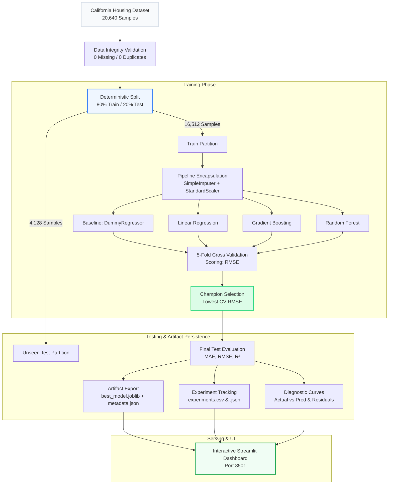

<div align="center">

# ML Model Lab

### Leak-Free Regression Benchmarking, Diagnostic Analysis & Interactive Valuation

[](https://www.python.org/)
[](https://scikit-learn.org/)
[](https://streamlit.io/)
[](https://github.com/VarunNa3530J/LM-Model-Lab/actions/workflows/ci.yml)
[](https://docs.pytest.org/)
[](LICENSE)

<p align="center">
  <b>A reproducible, leak-free machine learning benchmark evaluating multiple regression architectures against a naive baseline on California census records, backed by strict preprocessor encapsulation, deterministic validation, and an interactive Streamlit application.</b>
</p>

[Overview](#-overview--problem-statement) •
[Features](#-key-features) •
[Tech Stack](#-tech-stack) •
[Methodology](#-model-comparison-methodology) •
[Benchmark Results](#-benchmark-results) •
[Quickstart](#-installation--setup) •
[Diagnostics](#-model-diagnostics--results-interpretation) •
[Troubleshooting](#-troubleshooting)

</div>

---

## 📌 Overview & Problem Statement

Many machine learning projects demonstrate overly optimistic test scores due to subtle data leakage — such as fitting scalers or imputers on the full dataset before splitting, or tuning hyperparameters directly against the test partition. In production, this causes models to severely degrade when exposed to real unseen data.

**ML Model Lab** addresses this by implementing an auditable, leak-free benchmarking laboratory:
1. **Strict Split-First Design**: Imputation and scaling are encapsulated inside Scikit-Learn `Pipeline` objects fitted strictly on training folds. The test split is held out completely until final verification.
2. **Honest Baseline Comparison**: Every candidate model is evaluated against a `DummyRegressor` (predicting the training mean) to quantify true algorithmic value-add.
3. **Cross-Validation Model Selection**: Winning architectures are chosen solely by 5-fold cross-validation RMSE on training data, preventing test set snooping.
4. **Reproducible Experimentation**: Every training execution logs hyperparameter configurations, deterministic seeds, cross-validation spreads, and test metrics to both structured CSV and JSON ledgers.
5. **Interactive Exploration**: An interactive Streamlit dashboard enables users to inspect model diagnostic curves, run real-time inference with input boundary checks, and review full experiment histories.

---

## ✨ Key Features

- **Encapsulated Preprocessing**: Preprocessors (`SimpleImputer`, `StandardScaler`) are coupled directly with regressors in pipeline objects to ensure no data leakage across folds.
- **Multi-Model Benchmark**: Evaluates Baseline (`DummyRegressor`), Ordinary Least Squares (`LinearRegression`), `GradientBoostingRegressor`, and `RandomForestRegressor`.
- **Deterministic 5-Fold Cross-Validation**: Cross-validation uses fixed seeds across all models with identical fold splits (`KFold(n_splits=5, shuffle=True, random_state=42)`).
- **Automated Artifact Persistence**: Automatically serializes the best performing pipeline (`models/best_model.joblib`), audit metadata (`models/metadata.json`), metrics tables (`results/metrics.csv`), and environment lockfiles (`results/environment.txt`).
- **Interactive Streamlit Dashboard**: Includes KPI summaries, comparative charts, diagnostic residual analysis, interactive single-sample property valuation, and run-by-run audit logs.
- **Robust Inference Guardrails**: Prediction layer validates schema completeness, checks numeric validity, handles unit scaling ($\times 100,000$ USD), and flags out-of-distribution values against training extrema.
- **Comprehensive Offline Test Suite**: 20 unit and integration tests covering data integrity, metric calculations, split invariance, leakage prevention, and model persistence without network calls.
- **Continuous Integration (CI)**: Automated GitHub Actions workflow testing matrix across Python 3.12 and 3.13.

---

## 🛠️ Tech Stack

- **Core Language**: Python 3.12+ (tested on Python 3.12 & 3.13)
- **Machine Learning**: `scikit-learn` 1.9.1
- **Data Manipulation & Math**: `pandas` 2.3.3, `numpy` 2.4.2
- **Dashboard & Visualization**: `streamlit` 1.64.0, `matplotlib` 3.10.8, `seaborn` 0.13.2
- **Serialization**: `joblib` 1.5.3
- **Testing & Quality Assurance**: `pytest` 9.1.1, GitHub Actions CI

---

## 🔬 Model Comparison Methodology

To ensure total scientific integrity, the project enforces a deterministic, leak-free experimental pipeline:



1. **Deterministic Data Ingestion**: The dataset is downloaded via `fetch_california_housing` and audited for null values, infinite floats, duplicate rows, and schema compliance.
2. **Deterministic Partitioning**: Data is split into 80% training ($16,512$ samples) and 20% testing ($4,128$ samples) with a fixed seed (`seed=42`).
3. **Encapsulated Preprocessing**: Each candidate model is wrapped in an independent `Pipeline` containing `SimpleImputer(strategy="median")` and `StandardScaler()`. Preprocessors are fitted exclusively during `fit()` on training data.
4. **5-Fold Cross-Validation**: Every architecture is evaluated on the training set using identical fold splits. CV RMSE mean and standard deviation are recorded.
5. **Selection on CV Only**: The champion model is selected strictly by lowest mean CV RMSE. The test split is never used for model selection or hyperparameter tuning.
6. **Held-Out Evaluation**: All models are scored once on the unseen test split to calculate Test MAE, Test RMSE, and Test $R^2$.

---

## 📈 Benchmark Results

The following results reflect the empirical run executed with `seed=42` ($N = 20,640$ total samples, $16,512$ train, $4,128$ test), matching [`results/metrics.csv`](results/metrics.csv):

| Model Architecture | 5-Fold CV RMSE | Test MAE | Test RMSE | Test $R^2$ | Beats Baseline? | Improvement vs. Baseline |
| :--- | :---: | :---: | :---: | :---: | :---: | :---: |
| **Baseline (DummyRegressor)** | $1.1562 \pm 0.0122$ | $0.9061$ | $1.1449$ | $-0.0002$ | Baseline | $0.00\%$ |
| **Linear Regression** | $0.7205 \pm 0.0139$ | $0.5332$ | $0.7456$ | $0.5758$ | **Yes** | $+34.88\%$ |
| **Gradient Boosting** | $0.5321 \pm 0.0115$ | $0.3717$ | $0.5422$ | $0.7756$ | **Yes** | $+52.64\%$ |
| **Random Forest (Champion)** | $\mathbf{0.5097 \pm 0.0124}$ | $\mathbf{0.3268}$ | $\mathbf{0.5042}$ | $\mathbf{0.8060}$ | **Yes** | $\mathbf{+55.96\%}$ |

### Empirical Insights
- **Baseline Superiority**: All three statistical and machine learning models decisively outperformed the `DummyRegressor` baseline.
- **Top Performer**: **Random Forest** achieved the lowest CV RMSE ($0.5097$) and lowest Test RMSE ($0.5042$), delivering a **$55.96\%$ error reduction** relative to baseline.
- **Variance Explained**: Random Forest captures **$80.60\%$** of the variance in test property values ($R^2 = 0.8060$), substantially outperforming Linear Regression ($57.58\%$).
- **Generalization Consistency**: The close alignment between 5-Fold CV RMSE ($0.5097$) and Test RMSE ($0.5042$) demonstrates that the pipeline generalizes well without severe overfitting.

---

## 📂 Dataset Source & Description

The project uses the **California Housing Dataset**, derived from the 1990 U.S. Census and distributed via Scikit-Learn (`sklearn.datasets.fetch_california_housing`):

| Feature Name | Description | Units / Scale | Mean (Std) |
| :--- | :--- | :--- | :--- |
| `MedInc` | Median household income in block group | Tens of thousands USD ($10,000s) | 3.87 (1.90) |
| `HouseAge` | Median age of houses in block group | Years | 28.64 (12.59) |
| `AveRooms` | Average number of rooms per household | Count | 5.43 (2.47) |
| `AveBedrms` | Average number of bedrooms per household | Count | 1.10 (0.47) |
| `Population` | Total residents in block group | Persons | 1425.48 (1132.46) |
| `AveOccup` | Average number of household members | Persons / Household | 3.07 (10.39) |
| `Latitude` | Geographical block latitude | Decimal Degrees | 35.63 (2.14) |
| `Longitude` | Geographical block longitude | Decimal Degrees | -119.57 (2.00) |
| **Target (`MedHouseVal`)** | **Median house value for block group** | **Hundreds of thousands USD ($100,000s)** | **2.07 (1.15)** |

> **Note on Value Scaling**: The target `MedHouseVal` is expressed in units of $\$100,000$. A target value of `2.00` corresponds to $\$200,000$. In the prediction engine and dashboard, outputs are converted to standard USD ($\text{USD} = \text{prediction} \times 100,000$).

---

## 📐 Metrics Explanation

- **Mean Absolute Error (MAE)**: Measures average absolute magnitude of errors:
  $$\text{MAE} = \frac{1}{n} \sum_{i=1}^n |y_i - \hat{y}_i|$$
  Provides an intuitive dollar-magnitude error without overly penalizing outliers.
- **Root Mean Squared Error (RMSE)**: Penalizes larger deviations more heavily:
  $$\text{RMSE} = \sqrt{\frac{1}{n} \sum_{i=1}^n (y_i - \hat{y}_i)^2}$$
  Reported in the same units as the target variable.
- **Coefficient of Determination ($R^2$)**: Represents the proportion of target variance explained:
  $$R^2 = 1 - \frac{\sum (y_i - \hat{y}_i)^2}{\sum (y_i - \bar{y})^2}$$
  A score of $1.0$ indicates perfect prediction; $0.0$ matches the naive baseline; negative values indicate performance worse than predicting the mean.
- **5-Fold Cross-Validation RMSE**: The average RMSE across 5 non-overlapping training validation folds, reported with standard deviation ($\mu \pm \sigma$) to assess model variance and stability.

---

## 📁 Repository Structure

```
LM-Model-Lab/
├── .github/
│   └── workflows/
│       └── ci.yml              # GitHub Actions CI workflow (Python 3.12, 3.13)
├── app/
│   └── streamlit_app.py        # Interactive Streamlit dashboard
├── assets/
│   └── img/                    # Benchmark plots and visual assets
├── models/
│   ├── .gitkeep                # Keeps directory in Git (joblib files ignored)
│   ├── best_model.joblib       # Serialized champion pipeline (generated by train.py)
│   └── metadata.json           # Model audit metadata & feature bounds
├── reports/
│   └── figures/
│       └── .gitkeep            # Directory for generated diagnostic figures
├── results/
│   ├── .gitkeep                # Keeps directory in Git
│   ├── environment.txt         # Dependency lockfile generated during training
│   ├── experiments.csv         # Cumulative experiment tracking ledger (CSV)
│   ├── experiments.json        # Cumulative experiment tracking ledger (JSON)
│   ├── metrics.csv             # Benchmark comparison table (generated by train.py)
│   └── metrics_template.csv    # Documented schema template for fresh clones
├── src/
│   └── mlmodellab/
│       ├── __init__.py         # Package exports
│       ├── artifacts.py        # Model serialization and loading logic
│       ├── config.py           # Paths, seed configurations, and column schemas
│       ├── data.py             # Data fetching, validation, and split functions
│       ├── evaluate.py         # Metrics calculations and K-Fold CV engine
│       ├── features.py         # Sklearn Pipeline preprocessor construction
│       ├── models.py           # Model factory creating encapsulated pipelines
│       ├── plots.py            # Headless plot generation
│       ├── predict.py          # Single-sample inference & input validation
│       ├── tracking.py         # Structured experiment history logger
│       └── train.py            # End-to-end training entry point
├── tests/
│   ├── test_artifacts.py       # Persistence, missing-artifact, and logging tests
│   ├── test_config.py          # Configuration consistency tests
│   ├── test_data.py            # Data validation, null handling, and failure tests
│   ├── test_evaluate.py        # Exact arithmetic metric verification
│   ├── test_models.py          # Data leakage prevention & split invariance tests
│   └── test_predict.py         # Inference bounds & validation tests
├── .gitignore                  # Git ignore rules for virtualenvs, weights, caches
├── LICENSE                     # MIT License
├── pyproject.toml              # Modern package build configuration
├── README.md                   # Project documentation
├── requirements.txt            # Runtime dependencies
├── requirements-dev.txt        # Development and testing dependencies
└── setup.py                    # Backward-compatible package setup script
```

---

## 💻 Installation & Setup

### 1. Prerequisites
- **Python**: Version `3.12` or `3.13`
- **Git**

### 2. Clone the Repository
```bash
git clone https://github.com/VarunNa3530J/LM-Model-Lab.git
cd LM-Model-Lab
```

### 3. Create & Activate Virtual Environment

**Windows (PowerShell)**:
```powershell
python -m venv .venv
.venv\Scripts\Activate.ps1
```
*(If PowerShell restricts script execution, run `Set-ExecutionPolicy -ExecutionPolicy RemoteSigned -Scope Process` first)*

**macOS / Linux**:
```bash
python3 -m venv .venv
source .venv/bin/activate
```

### 4. Install Dependencies
```bash
python -m pip install --upgrade pip
pip install -r requirements-dev.txt -e .
```

---

## 🚀 Execution & Usage

### Step 1: Train Models & Generate Artifacts
Run the end-to-end training pipeline. This fetches the California Housing dataset, performs cross-validation, trains all candidate models, exports the best pipeline (`models/best_model.joblib`), saves metadata, and outputs diagnostic charts:

```bash
python -m mlmodellab.train
```

Expected output:
```text
============================================================
              ML MODEL LAB: TRAINING PIPELINE               
============================================================
Loading and validating California Housing dataset...
Dataset loaded: 20640 samples, 8 features.
Splitting dataset (80% train / 20% test, seed=42)...
Train samples: 16512 | Test samples: 4128
Running 5-fold cross-validation on training data...
Evaluating models on held-out test data...
Champion model: Random Forest (CV RMSE: 0.5097, Test RMSE: 0.5042)
Artifacts saved to models/best_model.joblib
Diagnostic figures saved to reports/figures/
============================================================
```

### Step 2: Launch the Interactive Dashboard
Once artifacts are generated, launch the Streamlit dashboard:

```bash
streamlit run app/streamlit_app.py
```

Open your browser to `http://localhost:8501`.

> **Note on Fresh Clones**: If you start the dashboard before running `train.py`, the application displays an actionable warning instructing you to run `python -m mlmodellab.train` instead of crashing.

### Step 3: Run the Automated Test Suite
Execute the offline test suite using pytest:

```bash
pytest -v
```

All 20 tests execute in under 5 seconds using deterministic synthetic data fixtures (no network required).

---

## 🔬 Reproducing Experiments

The training pipeline is fully deterministic. To reproduce exact metrics:

1. **Fixed Seed**: Controlled by `RANDOM_SEED = 42` in [`src/mlmodellab/config.py`](src/mlmodellab/config.py).
2. **Deterministic Split**: Train/test split uses `test_size=0.2, random_state=42`.
3. **Cross-Validation Split**: 5-Fold cross-validation uses `KFold(n_splits=5, shuffle=True, random_state=42)`.
4. **Experiment Ledger**: Repeated executions append run records to `results/experiments.csv` and `results/experiments.json` with a timestamp and unique run ID, while `results/metrics.csv` reflects the latest run.

Running `python -m mlmodellab.train` multiple times yields identical metrics for all four architectures down to four decimal places.

---

## 📊 Model Diagnostics & Results Interpretation

The training script generates high-resolution diagnostic charts in `reports/figures/` and copies them to `assets/img/`:

### 1. Actual vs. Predicted Plots
- Plots test set ground truth vs. model predictions along an ideal $y = x$ reference line.
- For Random Forest, predictions tightly cluster along the diagonal between $\$100,000$ and $\$400,000$.
- A horizontal flattening appears at the upper end ($\$500,000$) due to the census survey's cap at $5.0$.

### 2. Residual Distribution Plots
- Plots residuals ($y - \hat{y}$) against predicted values.
- Centered symmetrically around zero with homoscedastic variance across most price ranges, showing that the non-linear tree ensembles effectively mitigate systematic bias.

### 3. Model Comparison Bar Chart
- Displays CV RMSE and Test RMSE across all architectures side-by-side.
- Clearly illustrates the progressive performance improvements from Baseline $\to$ Linear Regression $\to$ Gradient Boosting $\to$ Random Forest.

### 4. Capturing Dashboard Screenshots
To add a live dashboard screenshot:
1. Start the app: `streamlit run app/streamlit_app.py`
2. Navigate to the **Model Benchmark** or **Valuation Simulator** tab.
3. Capture a screenshot (e.g., `Win + Shift + S` on Windows, or `Cmd + Shift + 4` on macOS).
4. Save the image to `assets/img/dashboard_preview.png` and link it in the README.

---

## ⚠️ Limitations & Responsible-Use Disclaimer

1. **Historical Census Data**: This project uses data from the **1990 U.S. Census**. Price dynamics, inflation, interest rates, and demographic distributions have changed significantly since 1990.
2. **Spatial Aggregation**: Data points represent census block groups (clusters of 600–3,000 individuals), not individual home sales. Predictions represent neighborhood aggregate tendencies rather than specific property valuations.
3. **Target Truncation (Right-Censored)**: Median values exceeding $\$500,000$ were capped at $5.0$ in the source survey. The model cannot reliably extrapolate property values in luxury markets exceeding this boundary.
4. **Educational & Portfolio Use Only**: This software is intended strictly for educational, research, and benchmarking demonstration. It is **not** financial, real estate, or investment advice, and must not be used for real-world automated property appraisals.

---

## 🔧 Troubleshooting

### Missing Model Artifacts on Startup
- **Symptom**: Streamlit displays `⚠️ Required Model Artifacts or Results are Missing!`
- **Solution**: Execute the training pipeline once:
  ```bash
  python -m mlmodellab.train
  ```

### Dataset Download Issues (Network Timeout / Proxy)
- **Symptom**: `DatasetLoadError: Failed to fetch California Housing dataset`
- **Solution**: Check internet connectivity. Scikit-learn caches the dataset locally under `~/scikit_learn_data/`. Once downloaded, subsequent training runs operate offline from cache.

### Module Import Errors (`ModuleNotFoundError: No module named 'mlmodellab'`)
- **Symptom**: Python fails to locate `mlmodellab` when running tests or scripts.
- **Solution**: Ensure you installed the local package in editable mode:
  ```bash
  pip install -e .
  ```

### PowerShell Execution Policy Error
- **Symptom**: `.venv\Scripts\Activate.ps1 cannot be loaded because running scripts is disabled`
- **Solution**: Grant script execution permission for the active session:
  ```powershell
  Set-ExecutionPolicy -ExecutionPolicy RemoteSigned -Scope Process
  ```

---

## 🔮 Future Improvements

- [ ] **Geospatial Feature Engineering**: Calculate geodesic distances to major California metropolitan centers (San Francisco, Los Angeles, San Diego) and coastal boundaries.
- [ ] **Advanced Architectures**: Add LightGBM, XGBoost, and CatBoost benchmarks.
- [ ] **Hyperparameter Optimization**: Integrate Optuna for automated Bayesian hyperparameter tuning within the cross-validation loop.
- [ ] **Model Explainability**: Add SHAP (SHapley Additive exPlanations) summary beeswarm plots and waterfall charts in the Streamlit UI.
- [ ] **API Endpoint**: Expose FastAPI endpoints for headless microservice inference with Docker containerization.

---

## 👤 Author

**Varun Ahuja**
- GitHub: [@VarunNa3530J](https://github.com/VarunNa3530J)
- Repository: [https://github.com/VarunNa3530J/LM-Model-Lab](https://github.com/VarunNa3530J/LM-Model-Lab)

---

## 📄 License

This project is licensed under the MIT License - see the [LICENSE](LICENSE) file for details.
